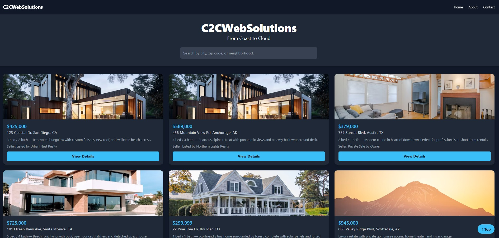

# 🏡 Real Estate Website Template — Coast to Cloud Web Solutions

This is a responsive, modern real estate listing site built using **Vite**, **Tailwind CSS v3**, and **vanilla JS** — designed as both a professional portfolio piece and a starting template for real-world real estate websites. It demonstrates front-end layout techniques, image galleries, component reuse, and clean project structure using modern frontend tools.

---

## ✨ Features

- 🔍 **Responsive Search & Listings Page**  
  Designed with Tailwind utility-first classes to scale beautifully across devices

- 🏘️ **Property Cards with Image Galleries**  
  Each listing includes a swipeable image gallery, description, seller info, and pricing

- 📦 **Modular File Structure**  
  Simple and extendable layout powered by Vite, clean separation of concerns

- 🎨 **Tailwind CSS v3 Integration**  
  Utility-first styling with custom configurations (colors, fonts, breakpoints)

- ⚡ **Fast Development Environment via Vite**  
  Lightning-fast HMR and modular JS/HTML/CSS support

---

## 📁 Project Structure

```
project-root/
├── index.html              # Root HTML file for listings
├── src/
│   ├── main.js             # Injects listings into DOM
│   ├── listing.js          # Imports property data and builds HTML
│   ├── data.js             # JSON-like array of property objects
├── style.css               # Tailwind base + custom styles
├── tailwind.config.js      # Tailwind configuration
├── postcss.config.js       # PostCSS config for Tailwind
├── public/                 # Static files (images, favicon, etc)
```

---

## 🧠 Why This Exists

This project isn't meant to be a massive, production-ready real estate CMS — though it *could* be extended into one. Its main purpose is to showcase the following:

- Learning and applying **Tailwind CSS** layout patterns
- Using **Vite** for modular JavaScript builds
- Writing clean, readable front-end code with reusability in mind
- Simulating a real-world web app environment that you might hand off to a client or business owner


---

## 🛠️ Technologies Used

- [Tailwind CSS](https://tailwindcss.com/docs)
- [Vite](https://vitejs.dev/)
- [Vanilla JavaScript](https://developer.mozilla.org/en-US/docs/Web/JavaScript)
- HTML5 / CSS3

---

## 🚀 Getting Started

### 1. Clone the repo
```bash
git clone https://github.com/YOUR-USERNAME/real-estate-template.git
cd real-estate-template
```

### 2. Install dependencies
```bash
npm install
```

### 3. Start the development server
```bash
npm run dev
```

### 4. Build for production
```bash
npm run build
```

---

## 🏗️ Next Steps For Expansion

- Add an admin portal using Flask or another backend
- Integrate a CMS like Sanity or Strapi
- Add map-based search or filters by ZIP/price
- Turn property cards into reusable components
- Deploy to AWS (S3, EB, CloudFront)

---

## 🧑‍💻 Author

**Michael Reigel**  
Founder @ [Coast to Cloud Web Solutions](https://c2cwebsolutions.com)  
Cybersecurity + Cloud student | USMC Veteran | Web Dev | System Admin

---

## 📸 Sample Screenshot



---

## 📄 License

This project is open source and available under the [MIT License](LICENSE).
